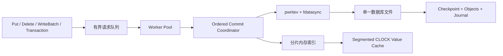

# MyTinyKVStore：高并发持久化键值存储引擎


MyTinyKVStore 是一个使用 C++17 编写的小型嵌入式键值存储引擎，面向原生 Linux POSIX 文件系统；WSL 使用时数据库必须位于 Linux 文件系统中。它将 checkpoint、对象数据和 journal 组织在单一数据库文件中，通过分片索引、并行请求准备和有序 group commit 提升并发吞吐，并提供批量写入、OCC 事务、崩溃恢复、后台压缩和运行指标。

## ✨ 功能特性

- **高并发执行**：默认使用 256 个 shard、独立读写锁、总 inflight 背压和 worker pool，并行处理键校验与事务帧序列化。
- **有序 Group Commit**：commit coordinator 按提交序号聚合请求，通过 `pwritev` 批量写入，并用一次 `fdatasync` 完成一组同步提交。
- **持久化与崩溃恢复**：双 superblock、CRC32C 校验、单调 LSN 和带 commit footer 的事务帧共同保证恢复一致性。
- **原子批量写入**：`WriteBatch` 被编码为一个事务帧，恢复后整批生效或整批不生效。
- **显式事务**：move-only `KVTransaction` 支持 read-your-writes、提交验证、回滚和 shard-version OCC 冲突检测。
- **多类型键**：点操作支持整数键、字符串键和二进制键；字符串键支持有序范围扫描及返回数量上限。
- **三种持久化模式**：提供同步、周期同步和手动同步模式，并通过 `Flush()` 建立明确的持久化屏障。
- **低停顿 Compaction**：后台生成新文件代际，最终切换只短暂停止提交，随后逐 shard 迁移内存 entry；仍在进行的读取可安全持有旧代际。
- **按需读取与缓存**：内存索引保存文件位置，value 通过 `pread` 读取；1–64 段的有界 CLOCK cache 加速热点访问。
- **进程级独占锁**：同一个数据库文件只允许一个存储实例打开。
- **可观测性**：内置吞吐、写延迟、group commit、同步耗时、事务冲突、compaction 停顿和 cache 命中率等指标。

## 🏛️ 架构概览



写入流程：

1. 调用线程规范化键并取得总 inflight 配额；raw、worker、prepared 和 coordinator 中的请求总数达到上限时形成背压。
2. worker 并行完成事务 payload 序列化、payload/value CRC32C 和物理 WAL charge 计算。
3. coordinator 按提交序号聚合准备完成的请求，验证事务版本、分配 LSN 并填充 frame header/footer。
4. 一组完整事务帧通过 `pwritev` 写入 journal；同步模式下执行一次 `fdatasync`。
5. 写入成功后，按 shard ID 顺序加锁并原子发布内存状态，再唤醒调用方。

点读取通过稳定哈希直接定位 shard，再从按规范化 key 与 LSN 标识的分段 CLOCK cache 或对应文件代际读取 value。字符串 `Scan` 绕过 cache，对各 shard 的有序索引执行 k-way merge；带 `limit` 的重载在锁内固定 entry 快照，随后释放 shard 锁再读取 value。

启动恢复会依次校验 superblock、checkpoint 和 journal。完整且校验通过的事务帧按 LSN 重放，不完整的尾帧会被忽略，已提交的批次不会恢复出部分结果。

Compaction 在开始时记录 journal 切点并构建 checkpoint；最终阶段只在 commit mutex 下复制 delta、同步临时文件、原子替换主文件并同步目录。旧 inode 会继续服务尚未迁移的 entry 和已经取得快照的读取，提交恢复后再逐 shard 切换 backing generation，因此不会为了重定位全部 key 长时间暂停写入。最后一个旧代际 reader 结束后，旧 inode 才自然回收。

## 🚀 快速开始

### 环境要求

- Linux，或将数据库放在 WSL Linux 文件系统中的 WSL
- CMake 3.15+
- 支持 C++17 的 GCC 或 Clang
- 提供所需 `flock`、`pread/pwrite`、原子 rename 和目录同步语义的 Linux POSIX 文件系统

Windows NTFS 的 WSL 挂载路径（如 `/mnt/c`、`/mnt/d`）、DrvFS、9p 和 fuseblk 未纳入持久化正确性或性能支持范围。源码可以位于这些路径，但数据库、测试临时目录和正式 benchmark 必须使用 WSL 原生 Linux 文件系统。

### 编译与测试

```bash
git clone https://github.com/Sakauma/MyTinyKVStore.git
cd MyTinyKVStore

cmake -S . -B build-release -DCMAKE_BUILD_TYPE=Release
cmake --build build-release --parallel
(cd build-release && ctest --output-on-failure)
```

构建产物位于：

- `build-release/target/lib/libkvstore.so`
- `build-release/target/bin/kv_test`
- `build-release/target/bin/kv_unit_test`

## 💻 API 示例

```cpp
#include "kvstore.h"

#include <cstdint>
#include <string>
#include <vector>

int main() {
    KVStoreOptions options;
    options.durability = DurabilityMode::kSync;
    options.max_batch_size = 64;

    KVStore store("example.db", options);

    // 整数、字符串和二进制键
    store.Put(42, Value(std::vector<uint8_t>{'o', 'k'}));
    store.Put(std::string("user:42"), Value(std::vector<uint8_t>{1, 2, 3}));
    store.Put(std::vector<uint8_t>{0x00, 0xFF}, Value(std::vector<uint8_t>{4, 5}));

    // 原子批量写入
    store.WriteBatch({
        BatchWriteOperation::PutInt(7, Value(std::vector<uint8_t>{'v'})),
        BatchWriteOperation::Delete("obsolete"),
    });

    // OCC 事务
    auto tx = store.BeginTransaction();
    tx.Get(42);
    tx.Put(42, Value(std::vector<uint8_t>{'n', 'e', 'w'}));
    tx.Put(std::string("audit:42"), Value(std::vector<uint8_t>{'1'}));
    tx.Commit();

    // 双端包含的字符串范围扫描，最多返回 100 项
    auto rows = store.Scan("user:0000", "user:9999", 100);
    (void)rows;

    // 建立持久化屏障并读取指标
    store.Flush();
    KVStoreMetrics metrics = store.GetMetrics();
    return metrics.transaction_commits > 0 ? 0 : 1;
}
```

`KVStore` 提供以下核心接口：

| 能力 | 接口 |
| --- | --- |
| 点操作 | `Put`、`Get`、`Delete` |
| 原子批量写 | `WriteBatch` |
| 字符串范围查询 | `Scan(start, end)`、`Scan(start, end, limit)` |
| 显式事务 | `BeginTransaction`、`Commit`、`Rollback` |
| 持久化屏障 | `Flush` |
| 空间回收 | `Compact` |
| 运行指标 | `GetMetrics`、`MetricsToJson` |

事务对象不可复制、可以移动；未提交事务析构时自动回滚。事务提交时若检测到 shard 版本变化，会原子失败并抛出 `KVStoreConflictError`。

## ⚙️ 持久化模式

| 模式 | 提交行为 | 适用场景 |
| --- | --- | --- |
| `DurabilityMode::kSync` | journal 同步到磁盘后返回 | 强持久化写入 |
| `DurabilityMode::kPeriodic` | 按配置周期统一同步，默认 10 ms | 吞吐优先的持久化写入 |
| `DurabilityMode::kNoSync` | 由调用方通过 `Flush()` 建立同步点 | 批量导入与外部同步控制 |

默认配置面向通用并发负载：

| 选项 | 默认值 |
| --- | ---: |
| shard 数 | 256 |
| 总 inflight 请求上限 | 4096 |
| worker 数 | 自动选择，最多 32 |
| group commit 最大请求数 | 64 |
| group commit 最大等待 | 1000 μs |
| value cache | 256 MiB |
| 持久化模式 | `kSync` |

WAL 容量指标按物理 frame 计数：`wal_bytes_since_compaction` 包含完整 header、payload 和 footer；frame 固定开销按 mutation 分摊。每个 key 只有最新 journal mutation 的 charge 属于 live，delete tombstone 在下一次 compaction 前也属于 live，并始终满足 `wal = live + obsolete`。

队列诊断可同时查看 `pending_queue_depth`、`prepared_queue_depth`、`inflight_request_count` 和 `max_inflight_request_count`；后台压缩环境错误由 `auto_compaction_failures` 累计。`MetricsToJson` 输出这些字段。

也可以使用内置负载配置快速生成参数：

```cpp
KVStoreOptions options = RecommendedOptions(KVStoreProfile::kWriteHeavy);
KVStore store("write-heavy.db", options);
```

可选 profile 包括 `kBalanced`、`kWriteHeavy`、`kReadHeavy` 和 `kLowLatency`。

自动 compaction 的字节阈值与无效比例阈值为 OR；比例条件默认还要求 WAL 至少达到 1 MiB，避免少量 hot-key 覆盖触发持续压缩。把 `auto_compact_min_wal_bytes_for_ratio` 设为 `0` 会显式恢复任意 WAL 大小的 ratio-only 行为。

## 🧪 测试与诊断

运行单元测试和集成测试：

```bash
./build-release/target/bin/kv_unit_test
./build-release/target/bin/kv_test
./build-release/target/bin/kv_unit_test --list
./build-release/target/bin/kv_test --list-groups
./build-release/target/bin/kv_test --group recovery-format
./build-release/target/bin/kv_test --filter "compaction"
```

筛选没有匹配时返回非零状态。设置 `KVSTORE_KEEP_TEST_ARTIFACTS=1` 会保留测试临时目录并打印其绝对路径，便于检查失败现场。

运行 ASan、UBSan 和 TSan：

```bash
bash scripts/ci-sanitizers.sh
```

Sanitizer 构建使用 `RelWithDebInfo`。ASan 默认启用 leak detection；TSan 保持数据竞争检测和 `halt_on_error`，并额外运行至少 10 秒 balanced 并发压力。

运行基准与并发压力测试：

```bash
./build-release/target/bin/kv_test bench
./build-release/target/bin/kv_test microbench
./build-release/target/bin/kv_test concurrency-stress 60 balanced
```

检查数据库文件：

```bash
bash scripts/inspect-format.sh example.db
bash scripts/verify-format.sh example.db
bash scripts/rewrite-format.sh example.db
```

格式检查工具与运行时恢复共用同一个只读解析器。`rewrite-format` 通过同步 compaction 重写当前数据库文件。

## 📁 项目结构

```text
include/kvstore.h        公共 C++ API
src/kvstore.cpp          API 实现与类型封装
src/internal/            存储格式、并发执行、I/O 与恢复实现
tests/unit/              单元测试
tests/integration/       持久化、事务与并发集成测试
scripts/                 构建、Sanitizer、基准和运维脚本
docs/                    文件格式、语义、事务与运维文档
```

## 📚 文档

- [文件格式](docs/file-format.md)
- [一致性与持久化语义](docs/semantics.md)
- [事务边界](docs/transaction-boundary.md)
- [运维手册](docs/runbook.md)
- [性能测试](docs/performance-baseline.md)
- [验收口径](docs/qualification-contract.md)

## 📄 开源许可证

MyTinyKVStore 基于 [MIT License](LICENSE) 开源。你可以自由使用、复制、修改、合并、发布和分发本项目。
